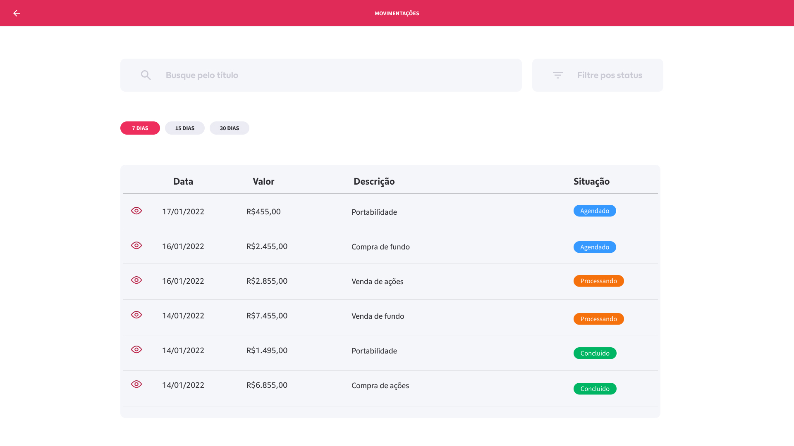
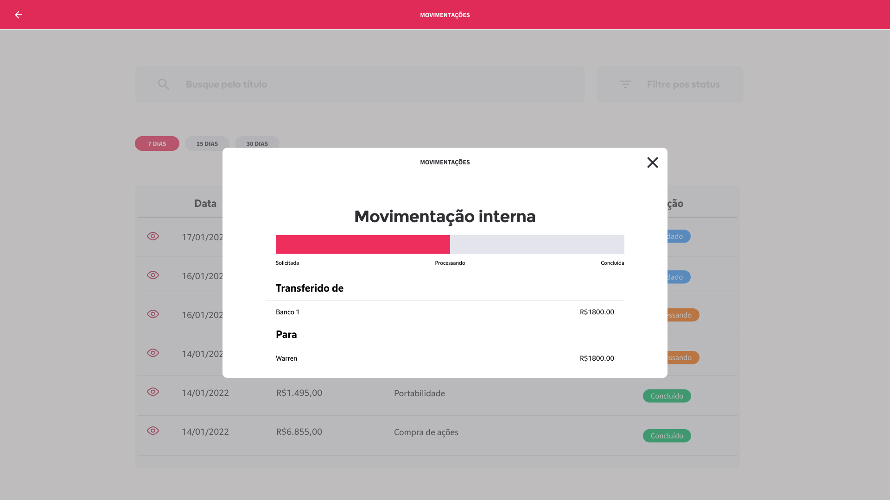

# :rocket: Accelerate Tribe Transactions Challenge Vue

### Como funcionária a mecânica do desafio

O dev deverá criar um novo repositório utilizando como template este, pois o mesmo conterá toda a arquitetura padrão warren já pronta para desenvolver os desafios.

Cada desafio, listados mais abaixo, deve representar um PR a ser avaliado pelos reviewers da tribo.

---
### Implementação :blue_book:

O desafio será implementar uma tela de lista de transações apresentando os principais dados relacionados a cada uma delas, ao clicar em uma transação será exibido um modal contendo os detalhes desta transação. O desafio deverá conter as seguintes funcionalidades:

- Lista de transações agrupada por data
- Filtro por título
- Filtro por status
- Modal contendo os detalhes da transação

É obrigatório e será avaliado o uso de:
- Vue com Typescript
- Padrão de arquitetura modular proposta nos desafios (Já vem estruturado, basta seguir :wink:)
- Axios
- Vue Class Components
- Vue property decorator
- Vuex
- Testes
- CI
---
### Desafio Inicial - Modularização

O desafio será implementar uma tela de lista de transações apresentando os principais dados relacionados a cada uma delas, ao clicar em uma transação será exibido um modal contendo os detalhes desta transação. O desafio deverá conter as seguintes funcionalidades:
- Lista de transações agrupada por data
- Filtro por título ( No momento apenas o campo )
- Filtro por status ( No momento apenas o campo )
- Modal contendo os detalhes da transação

Utilizar Vue com Typescript para o desenvolvimento da telas somente. 
Utilizar o mockup para as informações, dados abaixo.
Utilizar interfaces.

Obs.: não precisa ter as transações de transferência funcionais, é apenas tela.

###### Padrões a seguir

Arquitetura de pastas Modular

Kebab-case em props e eventos:
https://www.notion.so/warrenbrasil/Acordos-de-c-digo-ce16923c70f94925bd4d05d50ba81324

###### Mockup de Dados
Utilizar a seguinte interface
```
interface IState {
    id: String
    title: String
    description: String
    status: String
    amount: Number
    date: Date
    from: String
}
```

LIST ALL <IState[]>
```
[
  {
    "id": "5f89f9f257fe42957bf6dbfd",
    "title": "Resgate",
    "description": "et labore proident aute nulla",
    "status": "created",
    "amount": 2078.66,
    "date": "2018-12-22",
    "from": "Aposentadoria",
    "to": "Conta Warren"
  },
  {
    "id": "5f89f9f271e4213092bd4e41",
    "title": "Depósito",
    "description": "excepteur veniam proident irure pariatur",
    "status": "created",
    "amount": 148856.29,
    "date": "2017-07-23",
    "from": "Trade",
    "to": "Conta Warren"
  },
  {
    "id": "5f89f9f2f318e70ff298f528",
    "title": "Movimentação interna",
    "description": "eu officia laborum labore aute",
    "status": "processed",
    "amount": 25092.8,
    "date": "2016-08-25",
    "from": "Férias",
    "to": "Trade"
  }
]
```
GET ONE <IState>
```
{
  "id": "5f89f9f23e427f64fc2ea101",
  "title": "Depósito",
  "description": "aute aliqua eu excepteur et",
  "status": "processing",
  "amount": 51668.85,
  "date": "2020-01-01",
  "from": "Férias",
  "to": "Conta Warren"
}
```
##### Finalmente as telas
Lista de transações
    


Modais exemplos


    

    
---
### Desafio - Implementação do axios e padrões de componentes
    
- Implementar a funcionalidade dos filtros.
- Utilize os endpoints abaixo para substituir o mockup do Desafio 1.
- Utilize o axios para realizar as chamadas http.
- Mudar os componentes para utilizar o padrão vue class components:
    - https://class-component.vuejs.org/

Utilizar o vue-property-decorator: 
    - https://www.npmjs.com/package/vue-property-decorator
    
#### Endpoints

LIST : https://warren-transactions-api.herokuapp.com/api/transactions

SEARCH ONE: https://warren-transactions-api.herokuapp.com/api/transactions/:id

---
### Desafio - Implementação do Vuex
    
Implementar o Vuex, já configurado, com os estados da aplicação atual.
Utilizar o vuex module decorators.

Guia:

https://www.notion.so/warrenbrasil/Uso-do-Vuex-e26c55bfc2be4b24b3b62029c0897278
    
---
### Desafio - Implementação de testes
    
Testes unitários: Jest / Vue testing library
Testes funcionais: Cypress

Guia: 

https://www.notion.so/warrenbrasil/Guia-de-testes-77cd0b0045854c62a0029da5022cb6ec

Desafio aqui é tornar a nossa aplicação 100% coberta de testes.
---
### Desafio - Continous Integration
    
Utilizar o github actions no seu repositório para a implementação de 2 actions:

- Linter
- Testes
    
Guia:
https://www.notion.so/warrenbrasil/Acordos-de-c-digo-ce16923c70f94925bd4d05d50ba81324

---
### Desafio (Opcional) - Componentes do Nebraska
    
Nebraska-web é um pacote de componentes baseado no Design System Nebraska da warren.
É um guia com diversos componentes já prontos para utilização.
Para uso você precisa de acesso ao repositório abaixo:

https://github.com/warrenbrasil/nebraska-web

Caso não tenha, basta abrir um chamado com o service desk pedindo acesso ao github do time Developers: WEB.
    
Este desafio consiste em substituir os componentes feitos pelos do Nebraska.

https://docs.dev.warren.com.br/nebraska/?path=/story/nebraska-data-display-bankaccount--default-story

Abaixo estão uns links úteis dos componentes, mas sinta-se livra para implementar qualquer componente presente na documentação:

Modal:  https://docs.dev.warren.com.br/nebraska/?path=/docs/utilities-modal--default-story

Buttons: https://docs.dev.warren.com.br/nebraska/?path=/story/nebraska-general-button--button-sizes

Datatable: https://docs.dev.warren.com.br/nebraska/?path=/story/nebraska-data-display-datatable--data-table

StatusBar: https://docs.dev.warren.com.br/nebraska/?path=/docs/nebraska-data-display-statusbar--default-story

Input: https://docs.dev.warren.com.br/nebraska/?path=/docs/nebraska-data-entry-input--input-basic 

Select: https://docs.dev.warren.com.br/nebraska/?path=/story/nebraska-data-entry-select--select-basic

